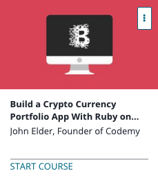

```
Roberto Nogueira  
BSd EE, MSd CE
Solution Integrator Experienced - Certified by Ericsson
```
# Udemy Build a Crypto Curreny Portfolio App with Ruby on Rails



**About **

Learn everything you need to about the subject of this `Udemy` project.

[Homepage](https://www.udemy.com/build-a-crypto-currency-portfolio-app-with-ruby-on-rails/learn/v4/content)

## Topics
```
Section: 1
0 / 5
Development Tools
[x] 1. Course Introduction 3:11
[x] 2. Intro To Cloud 9 3:25
[x] 3. C9 Walkthru 4:31
[x] 4. Version Control With Git 4:25
[x] 5. Github.com 6:07

Section: 2
0 / 8
Building A Basic Rails App
[x] 6. Creating Our First Webpage 4:04
[x] 7. Rails Routing 2:48
[x] 8. Manually Creating an About Page 3:00
[x] 9. Understanding Application.html.erb 2:58
[x] 10. Creating Links 3:34
[x] 11. Creating Partials 2:44
[x] 12. CSS With Bootstrap 5:39
[x] 13. Building a Bootstrap Navbar 6:23

Section: 3
0 / 7
Crypto Currency Data API
[x] 14. CoinMarketCap API Intro 3:24
[x] 15. Crypto Controller 4:56
[x] 16. Crypto Output 3:51
[x] 17. Looping Through The Output 6:02
[x] 18. Single Coin Lookup Form 5:12
[x] 19. Form Error Handling 2:39
[x] 20. Connecting To The API 4:40

Section: 4
0 / 7
Creating a User Management System
[x] 21. Intro To User Management With Devise 2:59
[x] 22. Installing Devise 5:54
[x] 23. Devise Database 4:40
[ ] 24. Devise Views and Routes 4:12
[ ] 25. Devise Links 6:04
[ ] 26. Devise View Bootstraping 4:01
[ ] 27. Devise Panel Views 5:23

Section: 5
0 / 15
Building A Portfolio System
[ ] 28. Intro To The Portfolio Database 3:12
[ ] 29. Creating a Crypto Database Table 5:52
[ ] 30. Portfolio View Pages 4:43
[ ] 31. Portfolio Links 4:23
[ ] 32. Rails Associations 4:36
[ ] 33. Associations Continued 4:06
[ ] 34. Defining The Correct User 5:46
[ ] 35. Bootstrapping the Listing Page Table 4:29
[ ] 36. Connecting To The API 4:39
[ ] 37. Cleaning Up The List Page 4:53
[ ] 38. Getting Price and Total Value 5:16
[ ] 39. Calculating Profit and Loss 4:27
[ ] 40. Calculating Percentage Change 3:22
[ ] 41. Running Total Profit Loss 4:27
[ ] 42. Tweaking the Show Page 6:47

Section: 6
0 / 5
Professional Web Hosting For Rails Apps
[ ] 43. Intro To Heroku Web Hosting 3:18
[ ] 44. Heroku Login 5:03
[ ] 45. Pushing Our Code To Heroku 7:08
[ ] 46. Heroku Domain Names 3:31
[ ] 47. Course Conclusion 4:01
```
